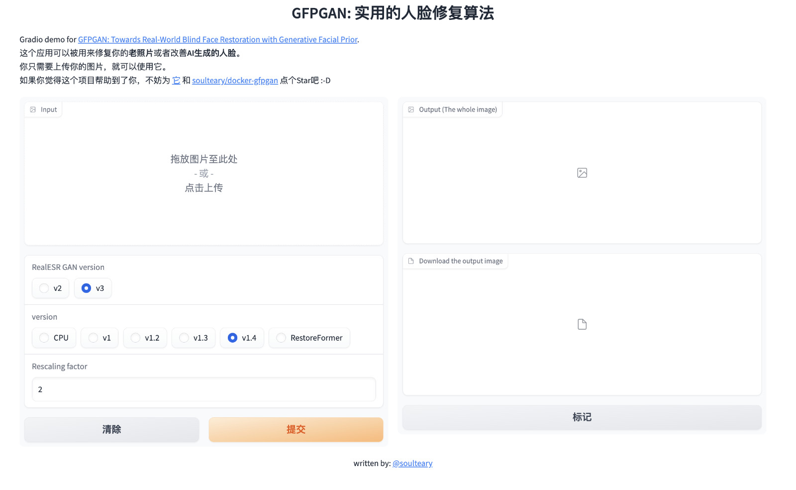
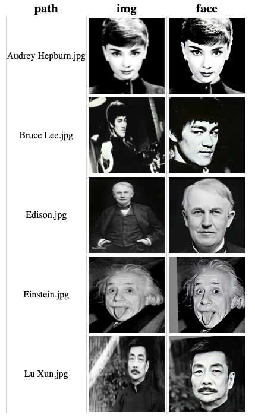

# Docker GFPGAN

腾讯 ARC 实验室 GFPGAN Docker 运行方案。


## 项目预览

第二篇教程相关：




第一篇教程相关：




## 使用方法

下载代码，执行脚本，构建镜像：

```bash
git clone https://github.com/soulteary/docker-gfpgan.git
cd docker-gfpgan
bash scripts/build.sh
```

在完成基础镜像构建之后，可以从[网盘下载 models.zip](https://pan.baidu.com/s/1j6JyPEpCOM4D9NYUnPh0SQ?pwd=soul)。

模型应用运行需要的所有模型都在这里了，下载完毕后，解压缩模型压缩包，将 gfpgan、model 两个目录放置到项目的根目录中，完整的项目结构是这样的：

```bash
├── docker
├── gfpgan
│   └── weights
│       ├── detection_Resnet50_Final.pth
│       └── parsing_parsenet.pth
├── LICENSE
├── model
│   ├── GFPGANCleanv1-NoCE-C2.pth
│   ├── GFPGANv1.2.pth
│   ├── GFPGANv1.3.pth
│   ├── GFPGANv1.4.pth
│   ├── GFPGANv1.pth
│   ├── README.md
│   ├── RealESRGAN_x2plus.pth
│   ├── realesr-general-x4v3.pth
│   └── RestoreFormer.pth
├── README.md
├── scripts
└── src
```

准备好模型文件之后，使用下面的命令启动模型应用：

```bash
docker run --gpus all --ipc=host --ulimit memlock=-1 --ulimit stack=67108864 --rm -it -v `pwd`/model:/app/model -v `pwd`/gfpgan:/app/gfpgan  -p 7860:7860 soulteary/docker-gfpgan
```

稍等片刻，我们将看到类似下面的日志：

```bash
Running on local URL:  http://0.0.0.0:7860

To create a public link, set `share=True` in `launch()`.
```

接着，我们就可以打开浏览器访问 http://localhost:7860 或者 http://你的IP地址:7860 来试试看啦。

## 相关教程

- 《[Stable Diffusion 硬核生存指南：WebUI 中的 GFPGAN](https://soulteary.com/2023/08/04/stable-diffusion-hardcore-survival-guide-gfpgan-in-webui.html)》
- 《[使用 Docker 来运行 HuggingFace 海量模型](https://soulteary.com/2022/05/20/use-docker-to-run-huggingface-models.html)》

## 相关项目

- https://github.com/TencentARC/GFPGAN
- https://github.com/soulteary/docker-pytorch-playground
